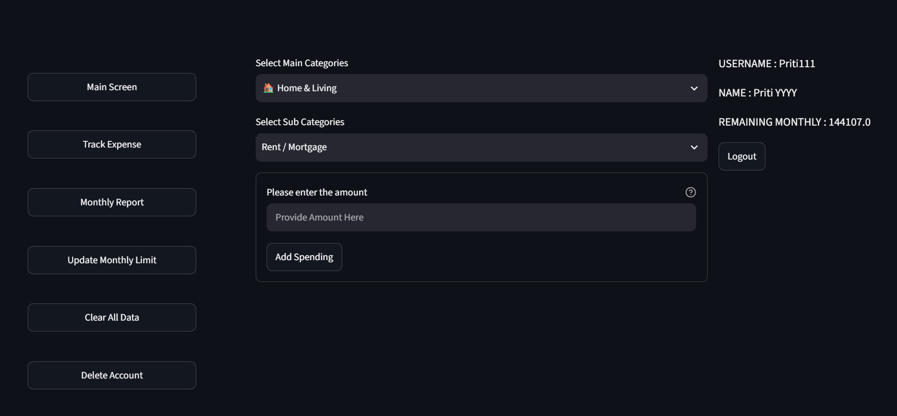
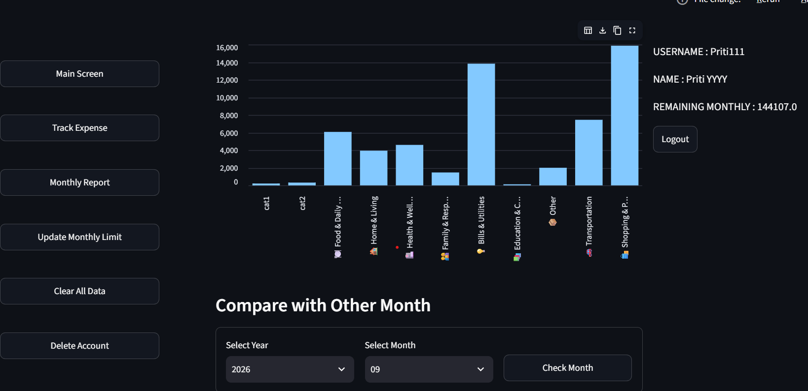

# Streamlit Expense Tracker
 📊  

> **A secure, full-stack personal finance and expense tracking desktop application built with Python, Streamlit, SQLite, and Pandas.**

---

## 📸 Screenshots & Demo

 



---

## 🌟 Key Features

* 🔐 **Secure User Authentication:** Account registration with password hashing, strict input format validations, and isolated user sessions.
* 📝 **Categorized Expense Logging:** Track daily spending across 12 main categories and dozens of subcategories (e.g., Home, Utilities, Food, Transportation).
* 💰 **Real-Time Budget Tracking:** Dynamically calculates total spent vs. monthly spending limits and displays remaining budget balances in real-time.
* 📈 **Interactive Visual Analytics:** Bar charts powered by Pandas dataframes to visualize spending breakdowns by category and compare metrics month-over-month.
* 🗄️ **Transactional Database Architecture:** SQLite storage managed via custom Python context managers to prevent data corruption and connection leaks.
* 🧹 **Data & Account Lifecycle Management:** Clean user workspace control options to reset historical logs or safely delete account data.

---

## 🛠️ Tech Stack & Architecture

* **Frontend / UI:** [Streamlit](https://streamlit.io/) (Responsive web dashboard framework)
* **Data Processing:** [Pandas](https://pandas.pydata.org/) (Data aggregation & analytical charts)
* **Database:** [SQLite3](https://www.sqlite.org/) (Lightweight relational database)
* **Security & Auth:** Cryptographic hash algorithms & regular expression input validators
* **Core Language:** Python 3.10+

### Project Structure

```text
Expense Tracker Application/
│
├── Expense_DB/
│   ├── expense_database_manager.py     # SQLite context manager & connection pool
│   └── expense_table_services.py        # Parameterized SQL query execution
│
├── Expense_Services/
│   ├── login_page_services.py          # User registration & password hashing
│   ├── main_page_services.py           # Pandas analytics & budget calculation
│   └── validation_services.py          # Input validation logic (Regex)
│
├── Expenses_User_Dictionary/
│   ├── expenses_user_dictionary.py     # User metadata JSON reader/writer
│   └── user_dictionary.json            # Encrypted user credentials & limits
│
└── Expenses_User_Interface/


    ├── Expenses_cat_subcat.py          # Category and sub-category mappings
    ├── Expenses_login_page.py          # Streamlit Login / Sign-up view
    └── Expenses_Main_Page.py           # Dashboard, tracking, & reporting views
